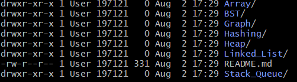

# CSE2101 - Data Structures and Algorithms Course

This Project acts as a Database of programmes related to the topics of Data Structures and Algorithms, provided by the members of the Coders-Cartel Organiaztion.

This is the file tree structure

In each of the directory, it contains a txt file which should contain all the questions regarding the Data structure and the code in separate files

# To Use this Repository

1. Clone the repo using git bash

   $ git clone https://github.com/Coders-Cartel/DSA.git

2. Open the folder in your desired IDE and add or modify code

3. Then commit all the locally made changes to the main branch of the git repo
   $ git status
   $ git add .
   $ git commit -m "modified a file"
   $ git push
